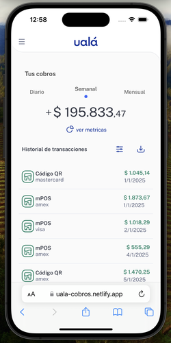

# Ualá - Historial de Transacciones 💳

Esta aplicación permite visualizar un historial de transacciones con filtros avanzados por fecha, monto, métodos de pago, tarjetas y cuotas.También da la posibilidad de descargar un PDF con las transacciones seleccionadas por fecha.
Fue desarrollada como desafío técnico utilizando tecnologías modernas de frontend.

 

---

## 🧑‍💻 Tecnologías utilizadas

- [React](https://reactjs.org/)
- [Vite](https://vitejs.dev/)
- [Zustand](https://zustand-demo.pmnd.rs/)
- [Radix UI](https://www.radix-ui.com/) (Collapsible, Switch, etc.)
- [Vitest](https://vitest.dev/) + [Testing Library](https://testing-library.com/)
- [Tailwind CSS](https://tailwindcss.com/)
- [Netlify Functions](https://docs.netlify.com/functions/overview/) (para evitar problemas de CORS)

---

## ⚙️ Instalación y ejecución

```bash
# 1. Clonar el repositorio
git clone https://github.com/jrostagno/dev-uala.git


cd dev-uala

# 2. Instalar dependencias
npm install

# 3. Crear archivo de entorno
cp .env.example .env.local
```

### Archivo `.env.local` (para desarrollo)

```env
VITE_API_URL=/api/transactions
```

```bash
# 4. Ejecutar en desarrollo
npm run dev

# 5. Ejecutar tests
npm run test

# 6. Build para producción
npm run build
```

---

## 🏗️ Arquitectura utilizada

```
src/
├── components/             # Componentes de UI
│   └── filters/            # Filtros reutilizables (fechas, montos, etc.)
├── icons/                  # Íconos SVG como componentes
├── infrastructure/         # Interfaces y mappers
├── store/                  # Estado global con Zustand
├── utils/                  # Utilidades generales (formateo, etc.)
├── test/                   # Tests unitarios con Vitest
└── App.tsx                 # Punto de entrada principal
```

- **Zustand** se usa para centralizar el estado de los filtros y datos cargados.
- **TanStack Query** podría incorporarse fácilmente para manejo de caché y data fetching.
- **Radix UI** proporciona componentes accesibles y sin estilos para personalizar.
- **Netlify Functions** se usan como proxy en producción para evitar CORS al acceder a la API de S3.

---

## 💡 Decisiones técnicas

- **Vite + React + TypeScript** por su rapidez de desarrollo y DX moderna.
- **Zustand** por ser más liviano y simple que Redux, ideal para este caso.
- **Vitest** por su integración perfecta con Vite.
- **Proxy local en **`` para evitar errores de CORS en desarrollo.
- **Netlify Functions** como proxy backend para evitar CORS en producción.

---

## Clean code 💅🏻

- **eslint y prettier** Se configuraron reglas de ESLint para mantener un código limpio y ordenado. Por ejemplo, se agregó una regla que organiza las importaciones de forma lógica cada vez que se guarda el archivo en el editor.

---

## 🌱 Posibles mejoras a futuro

- ✅ **Internacionalización (i18n)** para formatos de fecha/moneda.
- ✅ **Persistencia del estado de filtros** en LocalStorage.
- ✅ **Agregar paginación o scroll infinito**.
- ✅ **Testing más exhaustivo con mocks de interacciones complejas**.
- ✅ **Reemplazo de fetch con TanStack Query** para caching y retries.
- ✅ **Dark mode** con toggle global.
- ✅ **CI/CD con GitHub Actions para correr tests antes del deploy.**

---

## 🚀 Deploy

Este proyecto está desplegado en [Netlify](https://www.netlify.com/).

> URL de producción: [https://uala-cobros.netlify.app/](https://uala-cobros.netlify.app/)

---

## 📄 Licencia

MIT – © J.Rostagno
